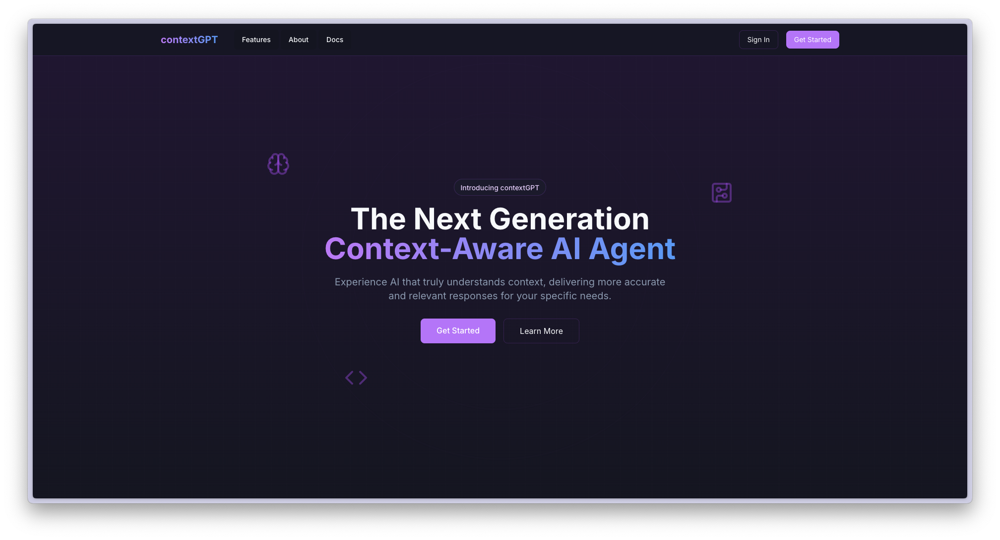
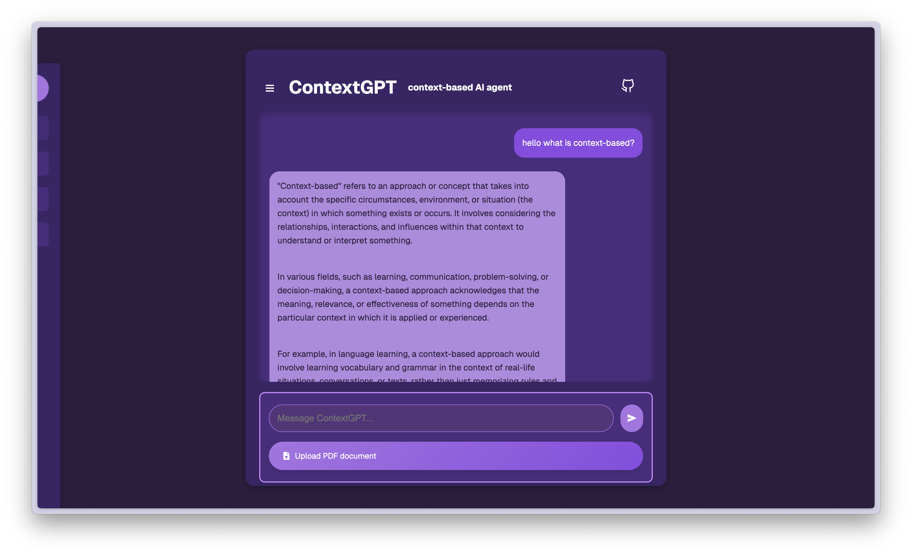

# A custom GPT assistant that enhanced your personal context

The purpose of this tool is to enhance LLM's understanding on personal customize content and learn from materials by feeding in course resources such as pdf, txt and markdown files.

This AI agent utilizes the semantic reasoning capabilities of LLaMA3, and integrates LangChain along with a vector database to enhance contextual understanding across diverse learning materials.

## [LINK TO HOMEPAGE](https://context-gpt-landing-page.vercel.app/)

**Homepage**

## [LINK TO BACKEND REPO](https://github.com/JackSuuu/contextGPT-backend)

- Langchain Framework
- Chroma Vector Database

## Features supported

1. upload context file
2. dedicate summary for the context
3. chat within the pure context file

## why still needs specialised AI agent when LLM like `chatgpt` and `deekseek` already exist?

1. Customisation for Specific Use Cases: LLM are **general-purpose** and may not be optimised for **specific workflows**
2. Efficiency & Cost Savings: specialised AI agents only focus on relevant inputs
3. Better Context Management: this is the most crucial point, in a general purpose LLM, since it remembers you previous questions, it will use those context as part of its computation

## How to use

To install or libraries required, run:

`pip install -r requirement.txt`

Then install Ollama deepseek model locally

`Ollama pull deepseek-r1:1.5b`

Or using the GROQ api:

`Fill in your api key in .env`

Finally unigpt-backend by using:

`fastapi run api.py`

and open unigpt-frontend run:

`npm run dev`

## Deployment services

- backend: fastapi -> Google Cloud
- frontend: Next.js -> Vercel

## Tech stack

- next.js and fast api
- typing-extensions
- langchain
- kaleido
- tiktoken
- python-multipart
- cohere
- openai
- Ollama
- transformers
- huggingface-hub
- chromadb
- sentence-transformers
- PyPDF2
