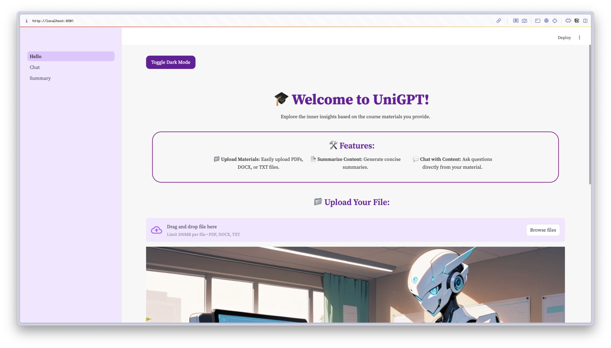
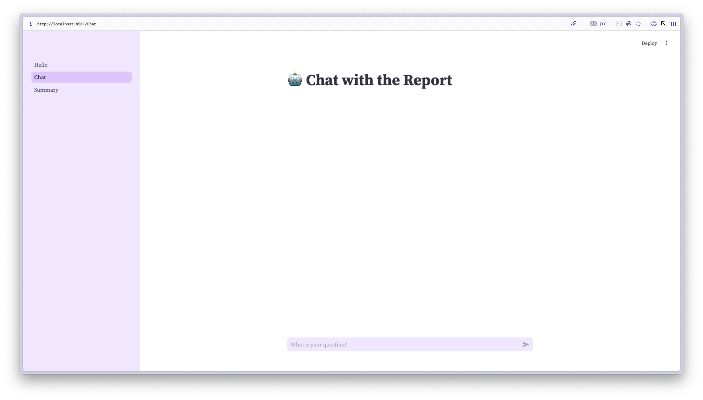

# A custom GPT assistant that enhanced your personal context

The purpose of this tool is to help university student revise their exam, 
learning new materials, by feeding the course resources such us Textbook, Tutorial sheet, course slides etc.
This AI agent utilized the strong semantic reasoning power that `deepseek-r1` provided,
which is great for any materials that related to logic and semantic reasoning.

**Homepage**

**chat section**

## Features supported

1. upload context file
2. dedicate summary for the context
3. chat within the pure context file

## How to use

To install or libraries required, run:

`pip install -r requirement.txt`

Then open streamlit by using:

`streamlit run Hello.py`

## Tech stack

- streamlit
- typing-extensions
- langchain
- kaleido
- tiktoken
- python-multipart
- cohere
- openai
- transformers
- huggingface-hub
- chromadb
- sentence-transformers
- PyPDF2