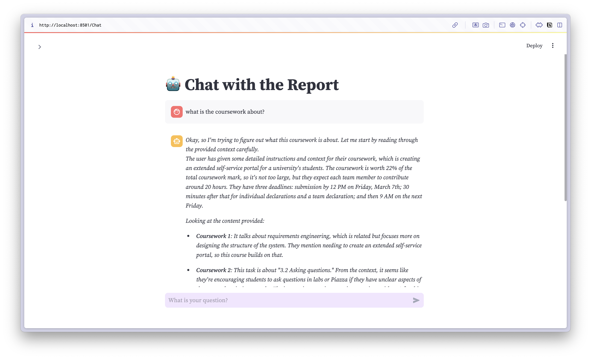

# A custom GPT assistant that enhanced your personal context

The purpose of this tool is to help university student revise their exam, 
learning new materials, by feeding the course resources such us Textbook, Tutorial sheet, course slides etc.
This AI agent utilized the strong semantic reasoning power that `deepseek-r1` provided,
which is great for any materials that related to logic and semantic reasoning.

**Homepage**

**chat section**

## Features supported

1. upload context file
2. dedicate summary for the context
3. chat within the pure context file

## How to use

To install or libraries required, run:

`pip install -r requirement.txt`

Then install Ollama deepseek model locally

`Ollama pull deepseek-r1:1.5b`

Finally open streamlit by using:

`streamlit run Hello.py`

## why still needs specialised AI agent when LLM like `chatgpt` and `deekseek` already exist?

1. Customisation for Specific Use Cases: LLM are **general-purpose** and may not be optimised for **specific workflows**
2. Efficiency & Cost Savings: specialised AI agents only focus on relevant inputs
3. Better Context Management: this is the most crucial point, in a general purpose LLM, since it remembers you previous questions, it will use those context as part of its computation

## Tech stack

- streamlit
- typing-extensions
- langchain
- kaleido
- tiktoken
- python-multipart
- cohere
- openai
- Ollama
- transformers
- huggingface-hub
- chromadb
- sentence-transformers
- PyPDF2